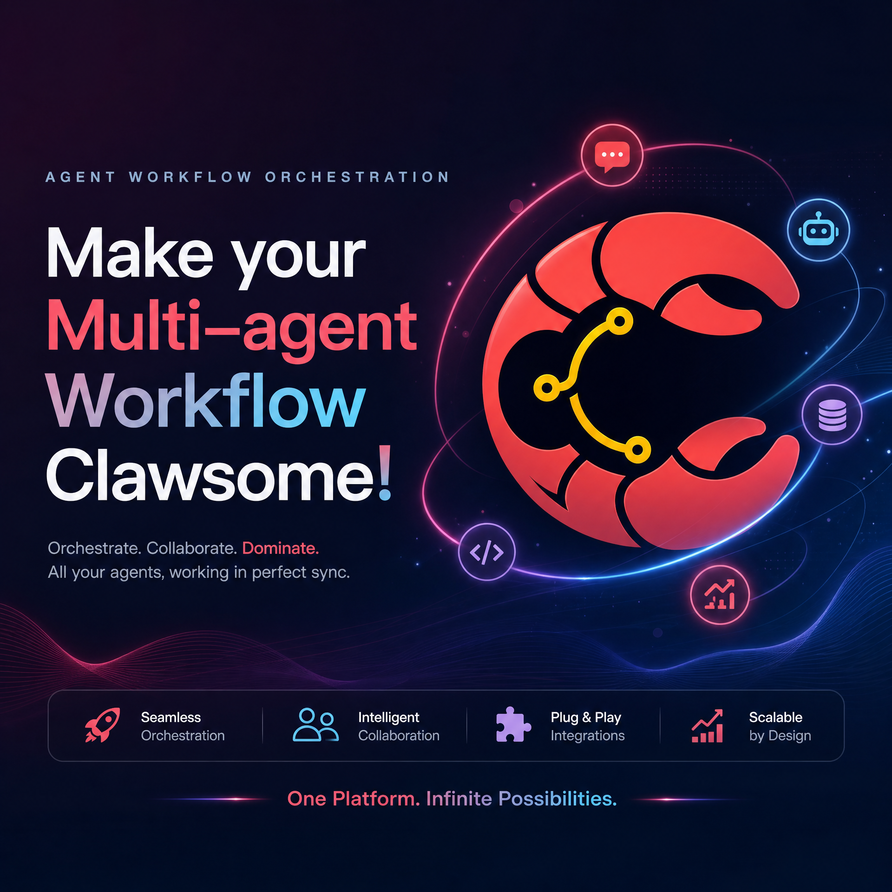
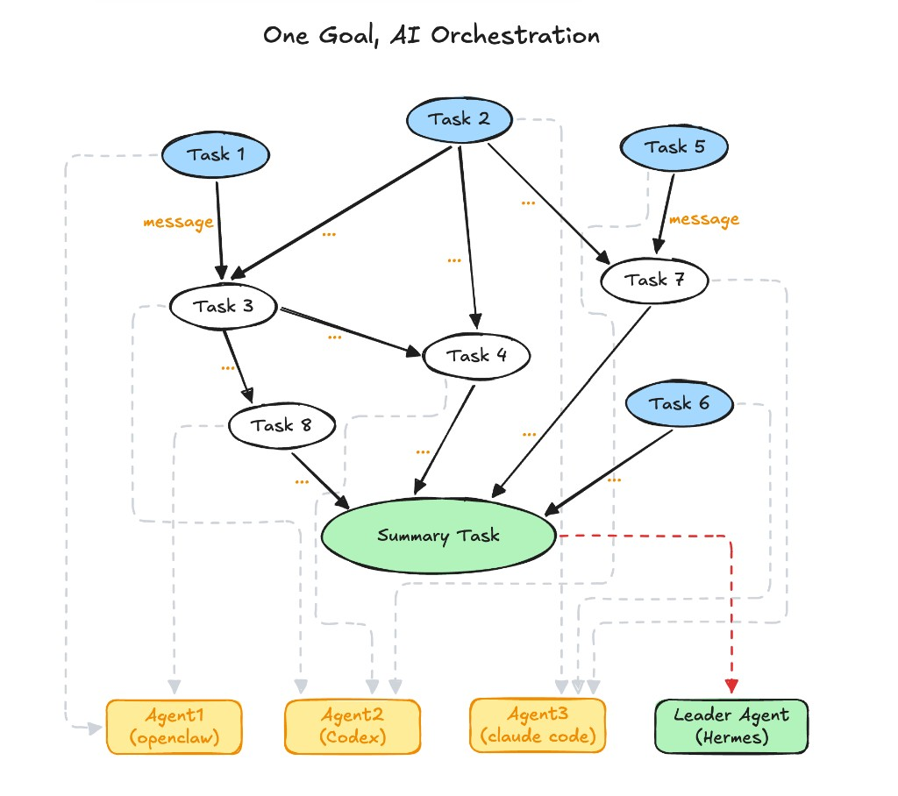
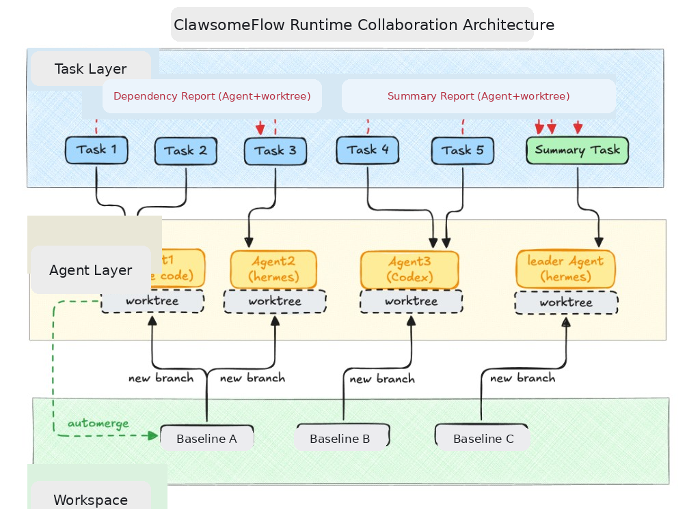

<div align="center">

<p>
  
</p>

<p>
  🌐 <a href="https://clawsomeflow.com"><b>clawsomeflow.com</b></a> ·
  📖 <a href="https://clawsomeflow.com/docs/"><b>Docs</b></a>
</p>

<p>
  <b>English</b> ·
  <a href="./readme.zh.md">简体中文</a>
</p>

<p><b>Turn your goal into a reusable task flow, and let an active scheduler drive a team of AI agents to execute it — parallel, isolated, observable, and convergent. You orchestrate the work; ClawsomeFlow keeps it under control.</b></p>

<p><b>Don't just run a one-off task — build a workflow that ships the same result reliably, again and again.</b> Define a Flow once, reuse it flexibly with execution parameters, and re-run it whenever you need it. And it's not just for coding: orchestrate <b>every role of a one-person company</b> — market, content, ops, customer service, engineering — into one <b>end-to-end, reusable</b> workflow.</p>

<p>
  <b>Full compatibility with</b> OpenClaw, Claude Code, Codex, Cursor, Hermes and other CLI Agents.
</p>

<p>
  <a href="#-quick-start">Quick Start</a> ·
  <a href="https://clawsomeflow.com/docs/">Docs</a> ·
  <a href="#-news">News</a> ·
  <a href="#-who-should-try-it">Who Should Try It</a> ·
  <a href="#-core-features">Core Features</a> ·
  <a href="#%EF%B8%8F-how-it-works">How It Works</a> ·
  <a href="#-why-clawsomeflow">Why ClawsomeFlow</a> ·
  <a href="#-contributor-local-deploy-and-test">Contributor Local Deploy</a> ·
  <a href="#-roadmap">Roadmap</a> ·
  <a href="#-community">Community</a>
</p>

<p>
  
  
  
  
  
  <a href="https://discord.gg/hcpMwXnrkM"></a>
</p>

</div>

---

## 📰 News

- **2026-06-02**: ClawsomeFlow public release 🎉

---

## 🎯 Who Should Try It?

- Builders of an **AI-native one-person company** who want to orchestrate **every role — not just coding** (market, content, ops, customer service, engineering) into one **end-to-end** workflow; founders and operators who systematically delegate repeatable work to agent teams;
- Developers and teams who need multiple agents to collaborate like a real team (plan, implement, verify, converge) — not just more chat windows;
- Ambitious **super-individual** creators — one person steering many specialized agents to continuously amplify output;
- Engineering-minded folks **done with prompt-only black-box orchestration** — predictable behavior, controllable cost, rollback guardrails;
- Building a software engineering agent team that can **develop in parallel across local branches**.

---

## ✨ Core Features

ClawsomeFlow turns scattered AI agents into a controllable engineering system — from the first instruction to the final, reviewable result.

| 🗣️ Get it done in natural language | 🧠 Precise orchestration, not guesswork | 🚀 Many agents, one graph |
|---|---|---|
| Define flows, create agents, orchestrate tasks, and step in at runtime — all by describing what you want. No glue code, no SDK wrangling. | Control flow lives in code, not in a prompt. The scheduler decides dispatch, retry, timeout and convergence — so behavior is predictable and tokens aren't wasted. | Lay out your work as a DAG and let multiple agents collaborate in parallel; a leader summarizes and converges the results into one deliverable. |

| 🔐 Isolation & rollback by default | 📊 Observability you can audit | 🔄 A system that improves itself |
|---|---|---|
| Built on Git worktree isolation with a **built-in cross-process repo lock**, ensuring absolute reliability of all agent collaboration behaviors; supports intelligent merge and rollback, and any merge can be quickly checked and  **reverted with one click**, plus optional human checkpoints for in-flight course correction. | Every dispatch, completion and failure is recorded as a RunEvent — each run is traceable, replayable and reviewable, with no black boxes. | Not happy with a result? File a complaint and the system reflects, reworks, and writes the lesson back — so the next run is better than the last. |

| ♻️ Reusable, reliably repeatable workflows | 🏢 End-to-end workflows for every role of a one-person company |
|---|---|
| Define a Flow once, reuse it with runtime parameters — stable, convergent, and auditable every time, not a one-off task. | Beyond coding: orchestrate market, content, ops, customer service, and engineering into one end-to-end, reusable workflow. |

ClawsomeFlow inherits the following capabilities from ClawTeam:

- **Git Worktree parallel isolation foundation**: each Agent has an independent branch and directory, naturally fitting multi-agent parallel development.
- **Inter-Agent messaging**: point-to-point inbox and broadcast, so team members share progress in real time.

> On top of this, ClawsomeFlow adds **AI combined with precise orchestration, enhanced Harness engineering (built-in cross-process repo lock for absolutely reliable multi-branch parallel development, intelligent merge and rollback — including a post-run per-agent Run diff and one-click merge revert, complaint-loop mechanism, optional human checkpoints for in-flight correction), deep OpenClaw/Hermes adaptation, and Web productization**.

---

## 🛠️ How It Works

From a sentence to a shipped result. You stay in charge of the goal; ClawsomeFlow handles the coordination, the parallelism, and the recovery when things go wrong.



1. **Describe your goal** — Tell ClawsomeFlow what you want in plain language, or compose a Flow visually as a graph of tasks and dependencies.
2. **Agents run in parallel** — The scheduler actively dispatches ready tasks to the right agents, each in its own isolated workspace, and drives them to completion.
3. **Watch, steer, recover** — Follow every step live. Retry, skip or abort with clear strategies, and approve results at human checkpoints before anything lands.
4. **Converge & deliver** — A leader merges the parallel work into one reviewed deliverable — and the run history stays fully auditable.

---

## 🧪 Developer Mode

Developer mode offers **software-development collaboration projects** a more flexible way to collaborate.

- **Upstream context for every subtask**: for each direct dependency, a subtask is injected with the upstream **agent id, worktree path, branch and base branch**, so it can flexibly build on that work — inspect it, merge that branch, or raise a PR for it — driven entirely by your task description.
- **Cross-branch collaboration in plain language**: in a downstream task, just write *"merge upstream agent X's worktree branch into branch Y"* or *"open a PR for X"*.
- **Built-in lock = absolute parallel-merge reliability**: many branches can develop and merge in parallel without ever racing or corrupting the repo. Whether the scheduler or an agent merges, every merge is serialized on the same lock — you can even direct cross-branch merges or PRs in plain language without risk.
- **Per-subtask auto-merge control**: each subtask can independently toggle auto-merge into the baseline branch.
- **Unique worktree per agent**: each agent creates its own worktree and independent branch from the baseline branch.
- **PR-friendly flow**: for subtasks you want to land via PR or manual review, turn auto-merge OFF.



---

## 🤖 Supported Agents

| Agent | Kind | Runtime | Status |
|---|---|---|---|
| **OpenClaw** | `openclaw` | TUI | ⭐ Deeply adapted |
| **Hermes** | `hermes` | TUI | ⭐ Deeply adapted |
| **Claude Code** | `claude` | TUI | ✅ Full support |
| **Codex** | `codex` | TUI | ✅ Full support |
| **Cursor** | `cursor` | TUI | ✅ Full support |
| **OpenCode** | `opencode` | TUI | Testing |
| **Gemini CLI** | `gemini` | TUI | Testing |
| **Kimi CLI** | `kimi` | TUI | Testing |
| **Qwen Code** | `qwen` | TUI | Testing |
| **Qoder CLI** | `qoder` | TUI | Testing |
| **CodeBuddy Code** | `codebuddy` | TUI | Testing |
| **nanobot** | `nanobot` | TUI | Testing |

---

## 🤔 Why ClawsomeFlow?

The common pain point of multi-agent frameworks is not "insufficient model capability", but "unstable collaboration control flow": the process is written in the Prompt, the final behavior depends on the Agent's in-the-moment understanding and model quality, and the system's predictability, cost and recoverability are all too weak.

ClawsomeFlow's approach is direct: **migrate coordination from natural language back into code, make concurrency isolation a default capability, and make failure handling a built-in part of the process.**

### 🆚 Comparison with Other Agent Orchestration Platforms

| Dimension | Other Multi-Agent Orchestration Platforms | ✅ ClawsomeFlow |
|---|---|---|
| **Reusability** | One-off execution: the process is uncontrollable and hard to reuse reliably | **Workflows are the deliverable** — define once, re-run flexibly via execution parameters for stable, convergent output every time |
| **Scope** | Mostly coding-only | **Every role of a one-person company** — market, content, ops, customer service, engineering — as one end-to-end workflow |
| **Engineering harness** | Generally missing; failures rely on Agent improvisation | **Harness engineering**: human checkpoints, rollbackable results, complaint-loop mechanism, periodic entropy management |
| **Task orchestration fit** | Mostly framework-specific, bound to a single ecosystem | Task orchestration is **deeply adapted to OpenClaw/Hermes Agents**, while also being compatible with any CLI Agent (Claude / Codex / Cursor, etc.) collaborating in the same graph |
| **Concurrency & isolation** | Easy contention in parallel, workspace conflicts, context cross-talk | **Workspace isolation and rollback under multi-task parallelism, and thoroughly resolves session conflicts**; **built-in cross-process repo lock makes parallel multi-branch development and merging absolutely reliable** |
| **Observability** | Context is mostly a black box | Full-chain RunEvent — traceable, auditable, replayable |

#### ✨ The Result?

**You own the goal, and ClawsomeFlow turns multi-agent collaborative execution into a stable, controllable, convergent engineering system.**

---

## 🧩 Relationship with ClawTeam

ClawsomeFlow is built on top of **ClawTeam**.

### 🔍 ClawTeam vs ClawsomeFlow at a Glance

| Dimension | ClawTeam | ClawsomeFlow |
|---|---|---|
| **Positioning** | Swarm-intelligence protocol foundation (Agent self-organization) | Agent workflow orchestration platform |
| **Collaboration driver** | Agents self-poll and self-schedule in the Prompt | Server-side scheduler actively dispatches, deterministic execution |
| **Collaboration flow** | Collaboration flow is uncontrollable; better suited to one-off tasks | Scheduler-driven deterministic workflows, suited to repeatable, convergent engineering collaboration |
| **Parallel-merge reliability** | **No repo-level merge lock** — concurrent baseline merges race and can corrupt git metadata; completely uncontrolled | **Built-in cross-process repo lock guarantees the absolute reliability of parallel multi-branch development** |
| **Failure & guardrails** | Basic lifecycle protocol | Human checkpoints / rollback / complaint-loop / entropy management |
| **Skill configuration** | Requires extra skill setup on the Agent platform | No extra skill configuration needed, works out of the box |
| **Usage form** | CLI + MCP + monitoring dashboard | Web UI + CLI, full-flow governance in natural language |
| **OpenClaw/Hermes adaptation** | Supported as an optional CLI Agent | Deeply adapted, resolving session and workspace concurrency conflicts |

---

## 🚀 Quick Start

> **Before you start — make sure your agent CLIs work.**
> ClawsomeFlow drives external agent CLIs (`claude`, `codex`, `hermes`, …) and
> agents **inherit your global CLI authentication**. So first install and log in
> to each CLI you plan to use and confirm it runs on its own (e.g. `claude -p hi`,
> `hermes` chat, `codex`). If a CLI isn't authenticated, agents using it will stall
> on a login prompt. For Hermes you can also set the model/provider/key per agent
> in **Settings → Model**. If you hit auth errors, verify the CLI's own
> model/provider config first.
>
> **Qoder / CodeBuddy** need a one-time auth: CodeBuddy via `codebuddy` →
> interactive login; Qoder via `export QODER_PERSONAL_ACCESS_TOKEN=…` (or
> `qodercli` → `/login`). ClawsomeFlow auto-seeds their folder-trust config
> (`trustAll` / `trustDirectories`) so unattended runs don't stall on the
> "trust this folder?" prompt — no action needed there.


### Install

Linux/macOS
```bash
curl -fsSL https://clawsomeflow.com/install.sh | bash
```


### Common Commands

Most of the time you only need these three:

```bash
csflow start      # start the service, print the console URL
csflow status     # is it running? version, mode, paths
csflow upgrade    # update to the latest release (flows/runs/settings preserved)
```

A few more for day-to-day use:

```bash
# Lifecycle
csflow stop
csflow doctor                              # health check (deps + config + gateway)
csflow uninstall --yes                     # stop service + unregister OpenClaw (keep data)
csflow uninstall --purge-data              # full wipe: type PURGE to confirm (irreversible)

# Flow / Run
csflow flows list
csflow runs start <flow-id> --input k=v    # trigger a run with parameter fields
csflow runs start <flow-id> --unattended   # run to completion with no human review/approval
csflow runs list
csflow runs result <run-id>                # status + the leader's final work report
csflow runs abort <run-id>

# Agent governance
csflow agents list
# Creating agents and chatting with them is done in the Web UI ("My Team"),
# not the CLI.

# MCP: let an agent drive Flows remotely (via its own channels, e.g. Telegram)
csflow mcp serve                           # stdio MCP server (agents spawn this)
csflow mcp list-platforms
csflow mcp install --platform hermes --agent <id>   # per-agent (Hermes; omit --agent for the default profile)
csflow mcp install --platform codex                 # global (codex/claude/cursor/gemini/opencode)
csflow mcp print-config --platform openclaw         # snippet to paste for unsupported platforms
```

Every command accepts `--help`. Full CLI reference: <https://clawsomeflow.com/docs/>

---

## 🔌 MCP: drive Flows from an agent (remote control)

`csflow mcp serve` exposes ClawsomeFlow as a stdio **MCP server**. Point one of your agents at it and — through that agent's own channels (Feishu, Telegram, …) — the agent can discover Flows, organize the inputs itself, trigger a run, and read back the **leader's final work report**. A typical loop: *user sends a file + a request over Telegram → the agent picks the right Flow and runs it → reads the leader report → replies over Telegram*.

**Tools the agent gets:** `list_flows`, `describe_flow` (shows a Flow's input fields), `run_flow` (triggers unattended — returns a run id immediately, skips human review/approval/checkpoints, runs to a terminal state), `get_run_status`, `get_run_result` (status + leader work report), `list_runs`, `abort_run`.

### Register it with your agent

```bash
csflow mcp list-platforms                              # see all supported platforms
csflow mcp install --platform hermes                   # Hermes: default profile
csflow mcp install --platform hermes --agent <id>      # Hermes: a specific agent profile
csflow mcp install --platform codex                    # global platforms (see table)
csflow mcp uninstall --platform codex                  # remove it again
```

| Platform | Scope | Config written |
|---|---|---|
| `hermes` | per-agent (`--agent <id>`; omit → **default profile**) | `~/.hermes/…/config.yaml` `mcp_servers` |
| `claude` | global | `~/.claude.json` `mcpServers` |
| `cursor` | global | `~/.cursor/mcp.json` `mcpServers` |
| `gemini` | global | `~/.gemini/settings.json` `mcpServers` |
| `codex` | global | `~/.codex/config.toml` `[mcp_servers.*]` |
| `opencode` | global | `~/.config/opencode/opencode.json` `mcp` |
| `openclaw`, `kimi`, `qwen`, `nanobot` | manual | print-config only (paste into the platform's own MCP config) |

Writes are **non-destructive** (existing servers and other keys are preserved) and **idempotent**. `install` skips a platform whose CLI isn't on `PATH` unless you pass `--force`.

### Manual configuration

For any platform (including the manual-only ones above), print a ready-to-paste snippet instead of writing files:

```bash
csflow mcp print-config --platform claude     # JSON: { "mcpServers": { "clawsomeflow": … } }
csflow mcp print-config --platform codex      # TOML: [mcp_servers.clawsomeflow]
csflow mcp print-config --platform hermes     # YAML: mcp_servers: …
```

The server entry is always the same command — register it manually if your platform isn't listed:

```json
{
  "mcpServers": {
    "clawsomeflow": { "command": "csflow", "args": ["mcp", "serve"] }
  }
}
```

The MCP server talks to your local ClawsomeFlow service over loopback (using the auto-generated api token), so the service must be running (`csflow start`).

---

## 👩‍💻 Contributor Local Deploy and Test

For contributors iterating on source code, use the isolated developer entrypoint:

```bash
bash scripts/deploy-contributor.sh
```

Default behavior of `deploy-contributor.sh`:

- Uses isolated data/runtime under `~/.clawsomeflow-dev` (does not reuse `~/.clawsomeflow`).
- Starts backend on `17117` and Vite on `5174`.
- Keeps ClawTeam runtime isolated via `~/.clawsomeflow-dev/.clawteam-data`.

`bash scripts/deploy-contributor.sh` is recommended for day-to-day source testing because it keeps regular user service state isolated.

Example with custom profile/ports:

```bash
CSFLOW_DEV_HOME=~/.clawsomeflow-dev-alice \
CSFLOW_DEV_BACKEND_PORT=18117 \
CSFLOW_DEV_FRONTEND_PORT=5184 \
bash scripts/deploy-contributor.sh
```

### Running the test suite

Run all tests inside Docker — a separate filesystem and network namespace mean a
test can never touch your real `~/.clawsomeflow` / `~/.openclaw` or a running
gateway:

```bash
scripts/test-in-docker.sh                                       # full backend suite
scripts/test-in-docker.sh -q backend/tests/test_api_guard.py   # subset (args → pytest)
```

Requires Docker and a local ClawTeam checkout (a sibling `../ClawTeam`, or set
`CLAWTEAM_SRC=/path/to/ClawTeam`). Do **not** run `pytest` directly on a host
that has a csflow/openclaw service running — it would reach the real gateway on
`:18789`.

### Stop the contributor service

To stop the contributor profile started by `deploy-contributor.sh`, use the
dedicated stop script:

```bash
bash scripts/stop-contributor.sh
```

Do **not** use `csflow stop` for the contributor profile — that targets
the end-user service. If you used a custom profile, pass the same env overrides:

```bash
CSFLOW_DEV_BACKEND_PORT=18117 CSFLOW_DEV_FRONTEND_PORT=5184 \
bash scripts/stop-contributor.sh
```

---

## 🗺️ Roadmap

| Phase | Content | Status |
|---|---|---|
| **P0** | **Agent Store** — a shareable marketplace for ready-made Agents, Teams and Flow templates: install, reuse, and contribute domain experts in one click. | 🚧 In progress |
| **P1** | **Broader Agent platform support** — onboard more CLI Agent runtimes and keep pace with emerging ecosystems, so any Agent can join the same graph. | 🚧 In progress |
| **P2** | **Mobile & server mode** — a mobile-friendly console plus multi-user server deployment, to monitor and intervene in Runs anywhere. | 💡 Exploring |
| **P3** | **Cloud & SSH Agents** — drive Agents on remote / cloud hosts over SSH, scaling collaboration beyond a single machine. | 💡 Exploring |

---

## 🙏 Acknowledgements

- **[ClawTeam]** — the spark that inspired this project. Thank you for showing what Agent self-organization can be.
- **Our Agent platform teammates** — the real "team members" that do the actual work inside every Flow: **Claude**, **OpenClaw**, **Codex**, **Gemini**, and the growing roster of CLI Agents. ClawsomeFlow is only as clawsome as the Agents it coordinates.

---

## 💬 Community

If ClawsomeFlow helps you coordinate your Agent team, **please give us a ⭐ Star** — it genuinely keeps us going.

Got questions about using ClawsomeFlow, or curious about building an **OPC (One-Person Company)**? Come hang out with us — join our Discord server or scan the QR code below to join our WeChat discussion group:

<p align="center">
  <a href="https://discord.gg/hcpMwXnrkM"></a>
</p>

<p align="center">
  
</p>

---

## 📄 License

MIT
