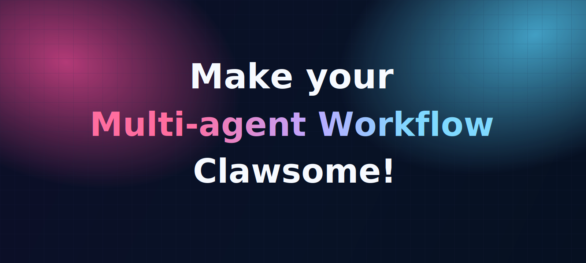
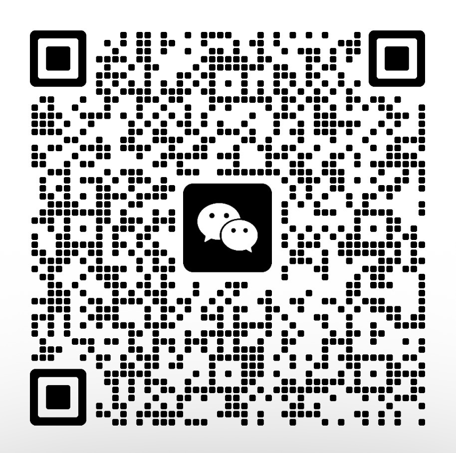

<div align="center">

<h1>⚡ ClawsomeFlow ⚡</h1>

<p>
  🌐 <a href="https://clawsomeflow.com"><b>clawsomeflow.com</b></a> ·
  📖 <a href="https://clawsomeflow.com/docs/"><b>Docs</b></a>
</p>

<p>
  
</p>

<p>
  <a href="./readme.md">English</a> ·
  <b>简体中文</b>
</p>

<p><b>把目标编排成一张任务流程图，由调度器主动驱动一支 AI Agent 团队去执行——并行推进、彼此隔离、全程可观测、稳定收敛地交付。你负责编排，掌控交给 ClawsomeFlow。</b></p>

<p>
  <b>Full compatibility with</b> OpenClaw、Claude Code、Codex、Cursor、Hermes等 CLI Agent。
</p>

<p>
  <a href="#-快速开始">快速开始</a> ·
  <a href="https://clawsomeflow.com/docs/">Docs</a> ·
  <a href="#-news">News</a> ·
  <a href="#-核心特性">核心特性</a> ·
  <a href="#%EF%B8%8F-工作原理">工作原理</a> ·
  <a href="#-为什么是-clawsomeflow">为什么是 ClawsomeFlow</a> ·
  <a href="#-贡献者本地部署与测试">贡献者开发</a> ·
  <a href="#-路线图">路线图</a> ·
  <a href="#-微信交流群">微信交流群</a>
</p>

<p>
  
  
  
  
  
</p>

</div>

---

## 📰 News

- **2026-06-02**：ClawsomeFlow 公开发布 🎉

---

## ✨ 核心特性

ClawsomeFlow 把零散的 AI Agent 变成一套可控的工程系统——从第一条指令，到最终可审阅的交付结果。

| 🗣️ 用自然语言搞定一切 | 🧠 精准编排，而非碰运气 | 🚀 众多 Agent，同一张图 |
|---|---|---|
| 定义 Flow、创建 Agent、编排任务、运行中实时干预——只需描述你想要什么。无需胶水代码，也无需折腾 SDK。 | 控制流写在代码里，而不是塞进 Prompt。调度器负责派发、重试、超时与收敛——行为可预测，Token 不浪费。 | 把工作编排成 DAG，让多个 Agent 并行协作；由 Leader 汇总并将结果收敛为一份交付物。 |

| 🔐 默认隔离与回滚 | 📊 可审计的可观测性 | 🔄 会自我进化的系统 |
|---|---|---|
| 每个 Agent 都在独立的工作区与分支中运行——并行而不串扰、不误写，内置 checkpoint / merge / cleanup。 | 每一次 dispatch / completion / failure 都记录为 RunEvent——每次运行都可追溯、可回放、可审阅，绝不是黑盒。 | 对结果不满意？发起一次「投诉」，系统会反思、返工，并把经验写回——让下一次比上一次更好。 |

ClawsomeFlow继承了Clawteam如下特色：

- **Git Worktree 工作区隔离**：每个 Agent 拥有独立分支与目录，并行互不干扰，支持 checkpoint / merge / cleanup。
- **Agent 间消息**：点对点 inbox 与广播，团队成员实时共享进展。

> ClawsomeFlow 在此之上，增加了 **AI与精确编排结合、Openclaw深度适配、失败收敛、人工护栏、Web 产品化** 等能力。

---

## 🛠️ 工作原理

从一句话，到交付成果。目标始终由你掌控；协作、并行，以及出错时的恢复，都交给 ClawsomeFlow。

1. **描述你的目标** —— 用自然语言告诉 ClawsomeFlow 你想要什么，或在画布上把 Flow 编排成任务与依赖关系图。
2. **Agent 并行执行** —— 调度器主动把就绪任务派发给合适的 Agent，每个 Agent 在独立工作区中运行，并被驱动至完成。
3. **观察、干预、恢复** —— 实时跟踪每一步。以清晰的策略重试、跳过或中止，并在人工检查点确认结果后再落地。
4. **收敛并交付** —— 由 Leader 将并行的工作合并为一份经过审阅的交付物，运行记录全程可审计。

---

## 🤖 支持的 Agent 平台

| Agent | Kind | 运行形态 | 状态 |
|---|---|---|---|
| **OpenClaw** | `openclaw` | TUI | ⭐ 深度适配 |
| **Claude Code** | `claude` | TUI | ✅ 完整支持 |
| **Codex** | `codex` | TUI | ✅ 完整支持 |
| **Gemini CLI** | `gemini` | TUI | Testing |
| **Cursor** | `cursor` | TUI | ✅ 完整支持 |
| **Hermes** | `hermes` | TUI | ✅ 完整支持 |
| **Kimi CLI** | `kimi` | TUI | Testing |
| **Qwen Code** | `qwen` | TUI | Testing |
| **OpenCode** | `opencode` | TUI | Testing |
| **nanobot** | `nanobot` | TUI | Testing |

---

## 🤔 为什么是 ClawsomeFlow？

多 Agent 框架常见的痛点不是「模型能力不足」，而是「协作控制流不稳定」：流程写在 Prompt 里，最终行为取决于 Agent 当下的理解和模型质量，系统的可预测性、成本与恢复能力都不够强。

ClawsomeFlow 的方法很直接：**把协调从自然语言迁回代码，把并发隔离做成默认能力，把失败处理做成流程内建。**

### 🆚 与其他 Agent 编排平台的对比

| 维度 | 其他多 Agent 编排平台 | ✅ ClawsomeFlow |
|---|---|---|
| **任务编排适配** | 多为框架特定，绑定单一生态 | 任务编排 **深度适配 OpenClaw Agents**，同时兼容 Claude / Codex / Cursor 等任意 CLI Agent 同图协同 |
| **并发与隔离** | 并行易竞争，workspace 冲突、上下文串扰 | 解决 OpenClaw 协同不稳定：**多任务并行时 workspace 隔离、可回滚，并彻底解决会话冲突** |
| **控制方式** | 纯 Prompt 自调度（黑盒）或纯代码（笨重） | **AI 与精确编排结合**：自然语言完成全部工作，调度器对行为做精准控制（派发 / 重试 / 超时 / 中止） |
| **工程护栏（Harness）** | 普遍缺失，失败靠 Agent 临场发挥 | **Harness engineering**：人工检查点、结果可回滚、投诉闭环机制、定期熵管理 |
| **失败恢复** | 依赖 Agent 自愈，结果不确定 | retry / skip / abort 明确策略，恢复路径纳入标准状态机 |
| **可观测性** | 上下文多为黑盒 | 全链路 RunEvent 可追踪、可审计、可回放 |

#### ✨ The Result?

**你负责目标，ClawsomeFlow 负责把多 Agent 协同执行做成稳定、可控、可收敛的工程系统。**

---

## 🧩 与 ClawTeam 的关系

ClawsomeFlow 构建在 **ClawTeam**  之上

### 🔍 ClawTeam vs ClawsomeFlow 简要对比

| 维度 | ClawTeam | ClawsomeFlow |
|---|---|---|
| **定位** | 群体智能协议底座（Agent 自组织） | Agent 工作流编排平台 |
| **协作驱动** | Agent 在 Prompt 中自轮询、自调度 | 服务端调度器主动派发，确定性执行 |
| **任务模型** | 看板 + 依赖链 | DAG Flow 编译，Leader 汇总收敛 |
| **OpenClaw 适配** | 作为可选 CLI Agent 支持 | 深度适配，解决会话与 workspace 并发冲突 |
| **失败与护栏** | 基础生命周期协议 | 人工检查点 / 回滚 / 投诉闭环 / 熵管理 |
| **Skill 配置** | 需要在 Agent 平台额外配置 skills | 无需额外配置 skills，开箱即用 |
| **使用形态** | CLI + MCP + 监控面板 | Web UI + CLI，自然语言全流程治理 |

---

## 🚀 快速开始

### 安装

Linux/macOS
```bash
curl -fsSL https://clawsomeflow.com/install.sh | bash

```

### 常用命令

```bash
# 生命周期
csflow start
csflow stop
csflow status
csflow doctor

# Flow / Run
csflow flows list
csflow runs list
csflow runs start <flow-id> --input k=v
csflow runs abort <run-id>

# Agent 治理
csflow agents list
csflow agents create "用自然语言描述你要的 Agent"
csflow agents chat <agent-id> "继续完善该 Agent 的能力"
```

---

## 👩‍💻 贡献者本地部署与测试

如果你是贡献者，需要在改源码后做本地部署验证，推荐使用隔离入口：

```bash
bash scripts/deploy-contributor.sh
```

`deploy-contributor.sh` 脚本默认行为：

- 使用隔离数据目录和运行时：`~/.clawsomeflow-dev`（不复用 `~/.clawsomeflow`）。
- 后端端口默认为 `17117`，Vite 端口默认为 `5174`。
- 默认将 ClawTeam 运行时隔离到 `~/.clawsomeflow-dev/.clawteam-data`。

日常贡献开发建议优先 `bash scripts/deploy-contributor.sh`，将测试环境与常规服务状态隔离。

自定义 profile / 端口示例：

```bash
CSFLOW_DEV_HOME=~/.clawsomeflow-dev-alice \
CSFLOW_DEV_BACKEND_PORT=18117 \
CSFLOW_DEV_FRONTEND_PORT=5184 \
bash scripts/deploy-contributor.sh
```

### 停止贡献者服务

停止 `deploy-contributor.sh` 启动的贡献者环境，请使用专用停止脚本：

```bash
bash scripts/stop-contributor.sh
```
请**不要**用 `csflow stop` 停止贡献者环境——那是用来停止正式用户服务的。
若你使用了自定义 profile，请传入相同的环境变量：

```bash
CSFLOW_DEV_BACKEND_PORT=18117 CSFLOW_DEV_FRONTEND_PORT=5184 \
bash scripts/stop-contributor.sh
```

---

## 🗺️ 路线图

| 阶段 | 内容 | 状态 |
|---|---|---|
| **P0** | **Agent Store**——可共享的 Agent、Team 与 Flow 模板市场：一键安装、复用并贡献领域专家。 | 🚧 进行中 |
| **P1** | **支持更多 Agent 平台**——接入更多 CLI Agent 运行时，持续兼容新兴生态，让任意 Agent 同图协作。 | 📅 规划 |
| **P2** | **手机端 & Server 模式**——移动端控制台 + 多用户服务端部署，随时随地监控与干预 Run。 | 💡 探索 |
| **P3** | **云端 Agent & SSH Agent**——通过 SSH 驱动远程 / 云端主机上的 Agent，把协作扩展到单机之外。 | 💡 探索 |

---

## 🙏 致谢

- **[ClawTeam]** —— 给了我们灵感的火花。感谢它展示了 Agent 自组织的可能。
- **各个 Agent 平台「团队成员」** —— 它们才是每个 Flow 里真正干活的「队员」：**Claude**、**OpenClaw**、**Codex**、**Gemini** 以及不断壮大的 CLI Agent 阵容。ClawsomeFlow 的精彩，源自它所协调的这些 Agent。

---

## 💬 微信交流群

如果 ClawsomeFlow 帮你协调好了 Agent 团队的工作，**请给我们一个 ⭐ Star** —— 这是支撑我们继续走下去的动力。

对 ClawsomeFlow 的使用有疑问，或者对成立 **OPC（一人公司）** 感兴趣？欢迎来和我们一起交流 —— 扫描下方二维码加入微信讨论社群：

<p align="center">
  
</p>

---

## 📄 License

MIT
